# pm-watcher · World Cup Cross-Platform Pricing Monitor

*by Yixuan · [中文版](./README.zh-CN.md)*

One World Cup, five prediction markets, five different answers. pm-watcher puts Polymarket, Kalshi, 42, Manifold and Predict.fun side by side as they price the 2026 World Cup in real time — so you can see where they agree, and where they diverge.

> A **read-only analysis tool.** It places no orders, connects no wallet, and needs no platform account. It answers *"what does the market think,"* not *"how do I bet."*

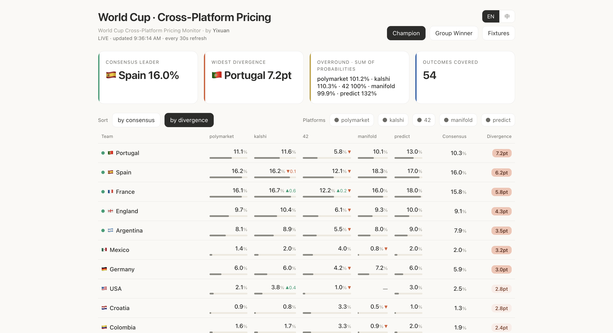

> ▶️ **Live board: https://pm-watchers.up.railway.app/** — explore the flagship views:
> the **Match Recap board** (how each finished match was *priced vs. how it ended*), the
> collectible **48-nation team cards**, and the knockout-stage
> **Parallel-Universe Champion Machine**. Read-only, no prediction, no betting.

## What it shows

- **Champion board** — title odds for all 48 teams, five platforms side by side, plus a consensus price and a divergence heatmap (darker = the platforms disagree more)
- **Group winner** — qualifying odds for all 12 groups (live data from Kalshi and 42)
- **Fixtures** — a schedule of ~80 group-stage matches, auto-generated from the platforms' own markets; tap any match for a cross-platform Win / Draw / Loss comparison and the spread
- **Knockout** — the road-to-the-final bracket with **true two-half seeding** and a qualification tracker that **forward-propagates decided winners** into the next round; the Parallel-Universe Champion Machine renders **inline in this tab** (below)
- **Live news × odds** — a BBC / Guardian / ESPN / Sky football feed plus Dongqiudi (Chinese), filtered by team; **tap a story to see that team's per-platform odds for ±3 hours around it** (the dashed red line marks the news timestamp)
- **News danmaku** — recent and newly arrived headlines drift across the top as bullet-screen pills; hover to pause and read, click to open, and a top-right button toggles the stream off
- **Persisted history** — every odds change is written to a local SQLite file (change-driven: nothing is stored while a price holds steady). When the tournament ends, `history.db` is a complete record of how five markets priced 104 matches
- **Telegram alerts** — optional push when a cross-platform spread crosses your threshold
- **Bilingual UI** — English / 中文 toggle, top right

**A fixture expanded into a five-platform Win / Draw / Loss comparison:**

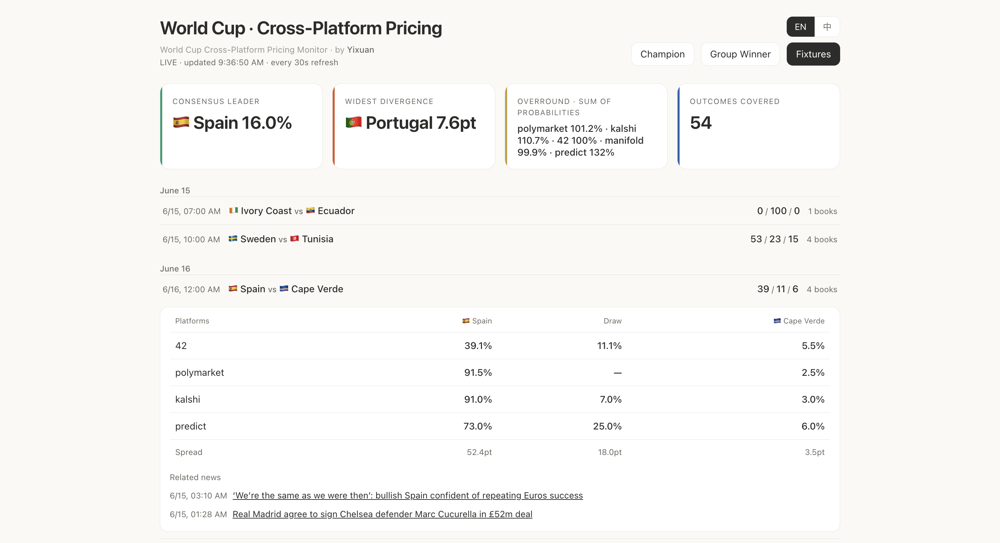

**Tap a news story to see the two teams' odds around it; ⚡ marks consensus moves the monitor caught:**

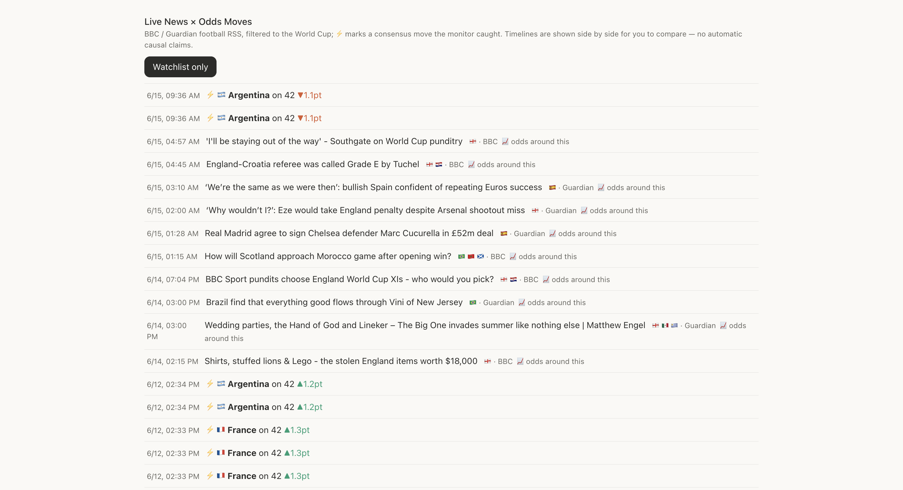

**News danmaku — headlines drift across the top like a bullet-screen; hovering a pill pauses it so you can read or click through, and the top-right button turns the stream off:**

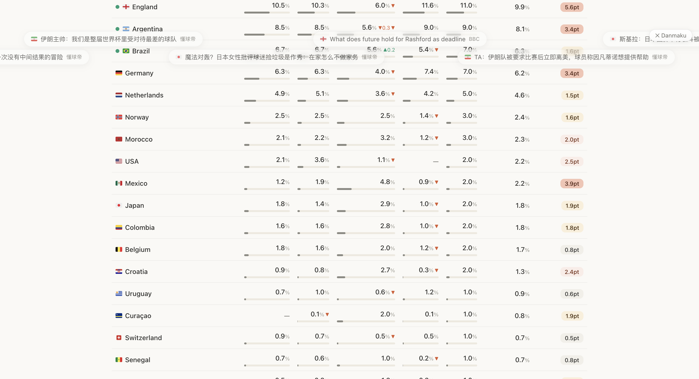

**News × odds in one picture — a story's timestamp dropped onto each platform's price line for the hours around it, so the relationship between a headline and a price move is visible at a glance (a temporal relationship, not a causal claim):**

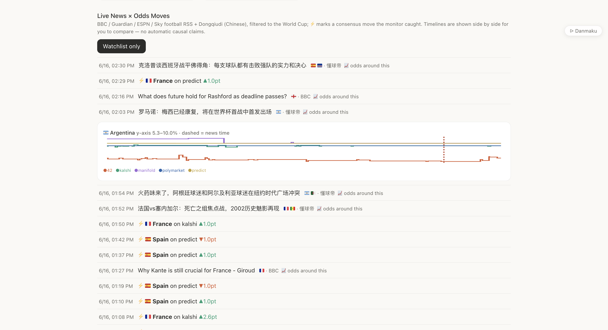

**A selectable watchlist — each card shows per-platform odds and a multi-platform history line:**

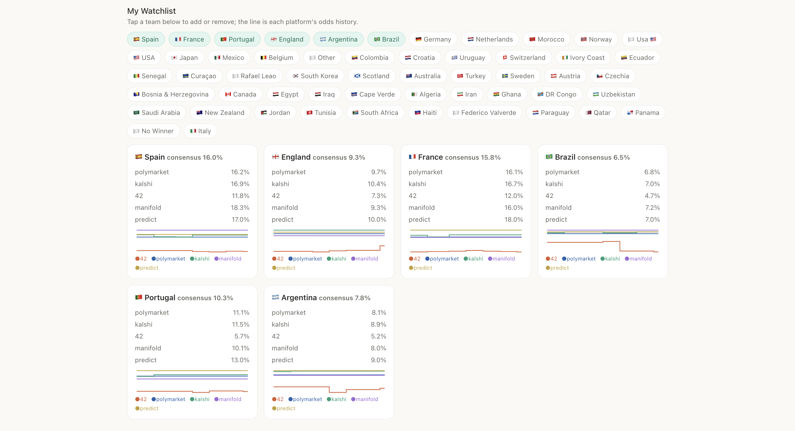

## 🆕 New in this release — the Parallel-Universe Champion Machine

The knockout rounds turn every fan into a counterfactual thinker: *what would it take for **my** team to win it all?* The Champion Machine answers with a collectible artifact. Pick any of the **32 knockout teams** on a radial sci-fi selector; the machine reverse-derives that team's championship path **along the real bracket** — five rounds, five opponents — and stamps the whole story onto a die-cut **champion's match ticket** you can download and share. It lives **inside the Knockout tab** — no page jump — in an auto-sizing embed, with a one-click full-screen view.

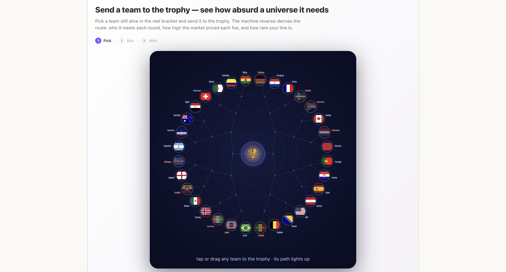

**Five verdicts on a ticket.** Each round of the path is a stamped module: the opponent, a meme-grade verdict in a double-printed rubber stamp (drawn from a hand-built corpus of player lore, tactical folklore and football superstition), a one-line story, two derivative hashtags, a parallel-universe scoreline (AET and penalty drama included) — and the market's pre-match price for that opponent, struck through and stamped **MISPRICED** or **BROKEN**. Every re-roll rotates the whole corpus, so verdicts change on each pull and never repeat within a ticket.

**Rarity as a blind-box tier.** The joint probability of the whole path sets the tier — STANDARD / RARE / EPIC / **LEGENDARY** (gold-foil frame) — and eliminated teams mint as **HIDDEN**: a universe that has already ended in reality is the rarest kind you can hold.

**A ticket that stays alive.** On load the machine syncs finished knockout results from the board's own recap API. Legs the team has actually won are stamped **✓ VERIFIED** and show the **real scoreline** — penalty shootouts included (`1–1 PENS`) — while the **universe lifeline** reads *alive · 2/5 verified*, or *ended @ Round of 16*. A share becomes a reason to come back after every matchday.

**National identity in the texture.** Every nation gets a signature motif woven into the ticket — seigaiha waves for Japan, a sunburst for Argentina, the šahovnica check for Croatia, zellige stars for Morocco, the Aztec greca for Mexico, St George's cross for England… — plus a punched perforation line, a barcode stub, and a triangular die-cut edge.

**Built to be shared.** One-tap export produces a presentation-ready PNG with a soft drop shadow tracing the die-cut teeth; a bilingual, auto-generated caption (team, rarity tier, final verdict, alive/ended hook) is copied to the clipboard the moment it finishes. On phones the ticket opens in a **long-press-to-save** sheet instead of a silent download, and the radial selector is tuned for touch drag. Every ticket carries a **scannable QR code and printed URL** deep-linking back to the machine, plus its **price-snapshot timestamp** — calibration language, not prophecy.

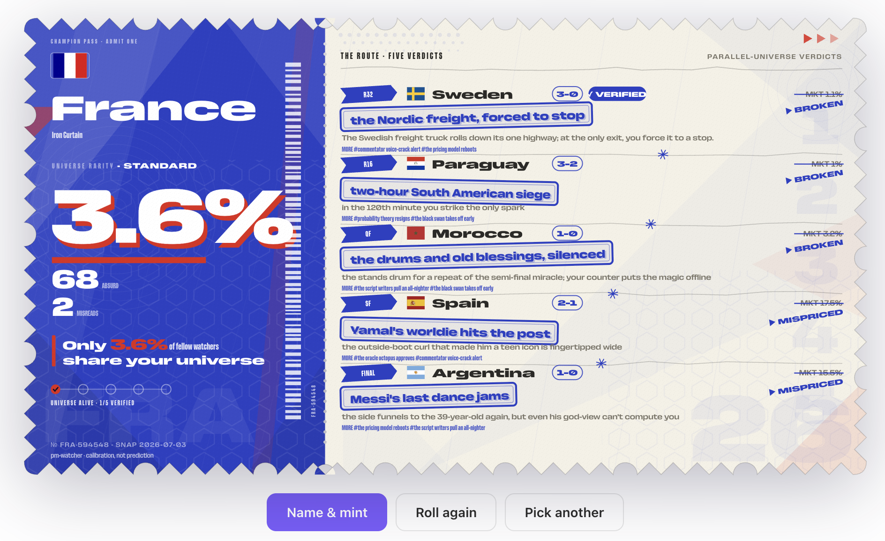

> The Champion Machine is entertainment built on market data. Rarity measures **how the five markets jointly priced a path**, not how good a team is. A built-in banned-words lint keeps every generated line — verdicts, stories, captions — free of betting language. Calibration, not prediction, all the way down.

## Retrospective board & team cards

Once a match is over, the question changes from *"what will happen"* to ***"who priced it right — and how wrong were the rest?"*** A retrospective layer under the project's guiding idea: **calibration, not prediction**.

### Match Recap board

- **Priced-vs-actual recap** for every finished match: the pre-match five-platform consensus set against the real Win / Draw / Loss result, with a hit-or-miss verdict.
- A **market-consensus record** pinned to the top — how often the consensus favourite actually delivered — with one-tap *delivered / fell-short* filtering.
- **Platform calibration**: a calibration chart plus a **Brier-score accuracy ranking** of the five platforms.
- A **shareable one-line headline** on every card — varied, not templated, bilingual (English headline with a Chinese sub-line in 中文 mode).
- Horizontal **date tabs** to jump to any match-day.
- **One-tap card export** (1080×1350 PNG) carrying the headline, the five-platform table, and a **QR code + link** back to the live board.

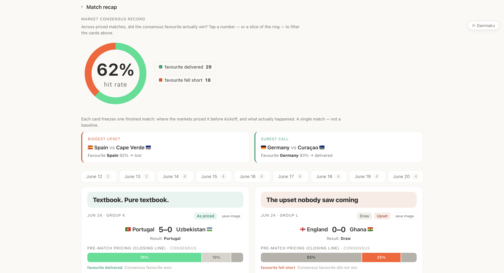

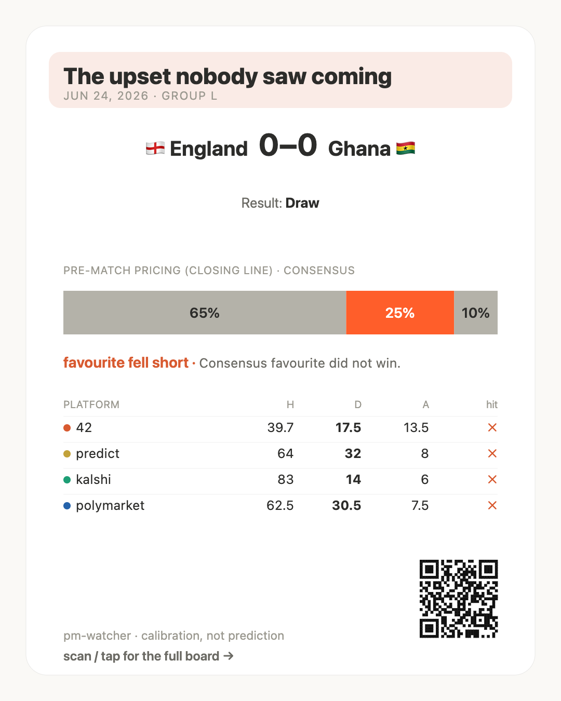

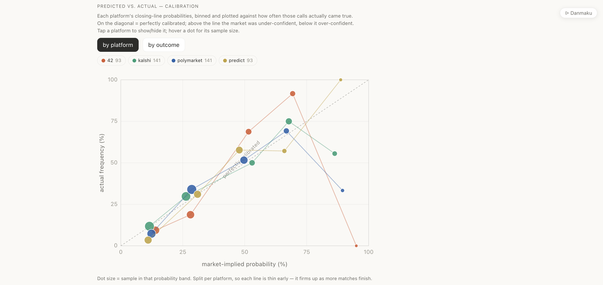

### Team cards

- A collectible **card for all 48 nations** in the official WC26-poster visual language — every nation has a **fixed colour + texture** (12 bold textures, no two alike), locked so only the data updates.
- A **Surprise Index** (S / A / B / C, 0–100) and a giant **±% gap** number: how far the market's pricing missed that team's actual results (it measures how wrong the market was, not a team's strength).
- Record, GF / GA, upsets made, and the team's single most surprising match.
- **One-tap PNG export** with a QR deep-link straight to that team; bilingual EN / 中文; gold stars for past champions.

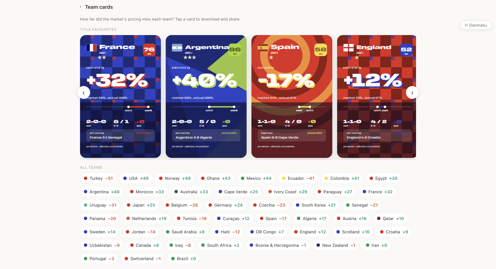

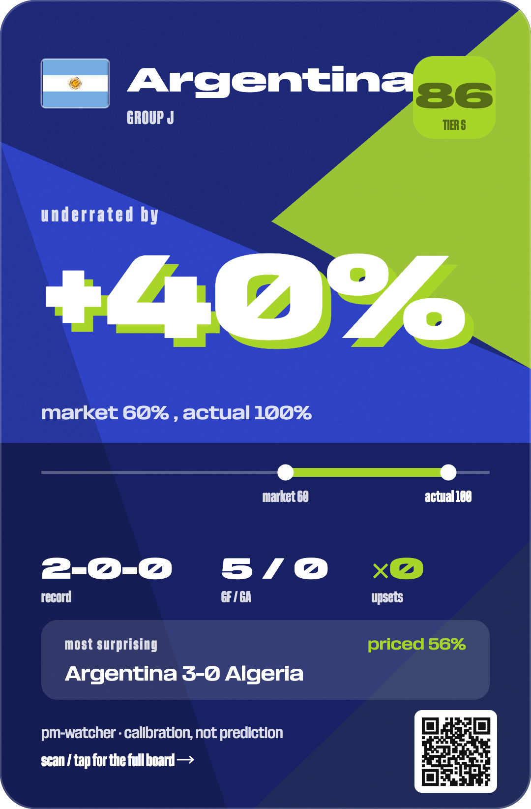

> Both boards are **retrospective and read-only** — they describe how the markets priced matches that have *already* happened. Still no prediction, no betting.

## Quick start

```bash
pip install -r requirements.txt

# Web dashboard (recommended):
python3 -m pm_watcher.serve --live --interval 30
# then open http://127.0.0.1:8765
# the Champion Machine is embedded in the Knockout tab (full-screen at /parallel-universe.html)

# Or command line:
python3 -m pm_watcher.watch --query "World Cup" --board --live
```

No API key required. Some data sources may need a proxy in certain network environments (`export HTTPS_PROXY=...`).

Telegram alerts (optional): copy `.env.example` to `.env`, add the token from @BotFather and your chat id, then pass `--notify` (CLI mode).

## The interesting part: the process

Cross-platform price comparison sounds like "put a few numbers next to each other." In practice every platform had a catch — and **these field-level lessons are worth more than the code**:

1. **42's `price` field is not a probability.** It is a bonding-curve token price (on the order of 0.0008); the outcomes don't sum to 1. The implied probability lives in the `marketCap` share — each outcome's market cap over the market total, which does sum to 100%. Use `price` directly and the entire column is wrong.
2. **Kalshi changed its price unit.** The legacy field was in cents (divide by 100); the newer `last_price_dollars` is already 0–1. Both appear in the response — read the wrong one and every probability is off by 100×.
3. **42's endpoint rejects requests that don't look like a browser.** The same URL opens in a browser but is refused for a bare client. Adding `Origin`, `Referer` and a real User-Agent resolves it. The WAF doesn't tell you what it wants.
4. **Metaculus's "public API" is no longer public.** It reads as usable in the docs; the actual response is `only available to authenticated users`. The only way to know whether an API works is to call it.
5. **Predict.fun's official API needs a key, but its web frontend uses an open GraphQL endpoint.** Introspection is enabled — following the schema surfaced a full World Cup fixtures interface (80 matches, real kickoff times). The richest source was the one outside the documentation.
6. **42's single-match markets are exact-score markets** (e.g. `NED 0–1 JPN`), not win/draw/loss. This project aggregates the score-level probabilities into a three-way price; outcomes it cannot classify are dropped honestly, so 42's three-way total can fall slightly below 100% rather than being force-normalized.
7. **One team has five different names across five platforms.** Türkiye/Turkey, Korea Republic/South Korea, Cabo Verde/Cape Verde, two spellings of Bosnia. Without canonicalization, a cross-platform comparison treats one team as two.
8. **SVG masks are not portable.** The ticket's punched perforation was first cut with a `<mask>`; browsers apply masks by luminance, some rasterizers by alpha — the same file punched holes in one renderer and ignored them in another. Rebuilding the holes as `clip-rule="evenodd"` sub-paths made the die-cut pure geometry, identical everywhere.
9. **On phones, `a.download` quietly does nothing.** In-app browsers (Xiaohongshu, WeChat) ignore the download attribute and blob URLs; a "download" button that works on desktop simply eats the tap on mobile. The reliable path is the platform's own gesture: render the PNG as a data-URL image in an overlay and let the user **long-press to save**.

## A few observations (as the group stage opens)

- Top-of-board pricing is tightly aligned: Spain and France stay within ~0.5pt between Polymarket and Kalshi — the efficiency of deep books is visible.
- 42 runs systematically low: Portugal, Germany and Argentina sit roughly 3pt below Polymarket/Kalshi — a fingerprint of thin liquidity and a market structure that diverts probability mass to an N/A outcome.
- The gap between play-money (Manifold) and cash markets is itself a signal: play-money forecasters rate Spain higher; real money is more cautious.

## Architecture

```
pm_watcher/
├── model.py                 # Market/Outcome models + client base class
├── polymarket.py            # Gamma API (public REST)
├── kalshi.py                # trade-api v2 (public REST; KXWCGAME matches / KXWCGROUPWIN groups)
├── fortytwo.py              # rest.ft.42.space (public REST; score market → three-way derivation)
├── manifold.py              # public REST (play-money forecaster consensus)
├── predict.py               # frontend public GraphQL (includes 80-match schedule)
├── names.py                 # country-name canonicalization + 48-team list
├── aggregator.py            # cross-platform merge (boards / fixtures)
├── history.py               # SQLite change-driven persistence
├── news.py                  # BBC/Guardian/ESPN/Sky RSS + Dongqiudi, filtered by World Cup / team
├── notifier.py              # Telegram push
├── serve.py                 # local dashboard server (http://127.0.0.1:8765)
├── dashboard.html           # single-page dashboard (no frontend build step)
├── parallel-universe.html   # the Champion Machine (self-contained page, ~160 KB incl. QR encoder)
├── fonts-subset/            # subset WC26 display fonts (woff2, ~88 KB total)
├── fonts/ · flags/          # full display fonts + 62 national-flag SVGs
└── watch.py                 # command-line mode
```

The only dependency is `httpx` (plus optional `python-dotenv`). Both pages are self-contained HTML files with no frontend build chain; the Champion Machine syncs live knockout results from `/api/recap` and embeds its fonts and flags into the exported PNG at download time.

## Data sources

| Platform | Type | Access | Probability field | Note |
|---|---|---|---|---|
| Polymarket | cash (Polygon) | public Gamma REST | `outcomePrices` (0–1) | deepest liquidity |
| Kalshi | cash (CFTC-regulated) | public trade-api | `last_price_dollars` | draw is labelled "Tie" |
| 42 | on-chain (Alpha) | public REST | `marketCap` share | thin; single-match = score market |
| Manifold | **play-money** | public REST | `probability` | forecaster consensus, not real money |
| Predict.fun | cash (BNB) | frontend public GraphQL | `chancePercentage` | integer-grained (sub-0.5pt is noise) |

## Honest boundaries

- **This is not an arbitrage tool.** Most of the spreads it shows are not executable: fees, settlement differences, capital lock-up, the unfillability of thin books, and platform and contract risk all consume the nominal gap. Its value is **understanding how markets price an event**, not extracting money from one.
- **The Champion Machine is entertainment built on market data.** Its rarity tiers measure how five markets jointly priced a path — not team strength — and every generated line passes a banned-words lint that keeps betting language out.
- Platform availability varies significantly by jurisdiction. Verify the law where you are and each platform's terms yourself. This project only reads public market data; it involves no registration, trading or funds.
- The news × odds chart shows a **temporal relationship, not a causal conclusion.**
- Nothing here is investment advice.

## License

MIT © Yixuan

*Built in collaboration with Claude (Anthropic).*
