# pm-watcher · 世界杯跨平台定价看板

*by Yixuan · [English](./README.md)*

同一场世界杯，五个预测市场，五种定价。pm-watcher 把 Polymarket、Kalshi、42、Manifold、Predict.fun 对 2026 世界杯的实时定价并排放在一张看板上——看它们在哪里取得共识，在哪里相互背离。

> 这是一个**只读的分析工具**：它不下单、不接钱包、不需要任何平台账号。它回答的是"市场怎么想"，不是"怎么下注"。

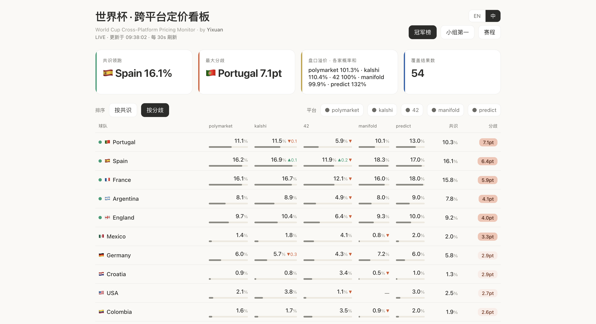

> ▶️ **在线看板：https://pm-watchers.up.railway.app/** —— 体验两大核心视图：
> **复盘看板**（每场已结束比赛「赛前定价 vs. 真实结果」）与可收藏的
> **48 国球队名片**。只读、不预测、不下注。

## 它呈现什么

- **冠军榜**——48 强夺冠定价，五平台并排，附共识价与分歧热力（颜色越深，平台间分歧越大）
- **小组第一**——12 个小组的出线定价（Kalshi、42 实时数据）
- **赛程**——约 80 场小组赛的时间表，由各平台自身的市场自动生成；点开任一场，查看跨平台的 胜/平/负 对比与价差
- **实时新闻 × 赔率**——BBC / Guardian / ESPN / Sky 足球新闻流，外加懂球帝（中文），按球队过滤；**点开一条新闻，查看该队在新闻前后 ±3 小时的逐平台赔率**（红色虚线标记新闻时刻）
- **新闻弹幕**——最近的（以及新到的）新闻以弹幕形式从顶部飘过；悬停可暂停阅读、点击可打开原文，右上角按钮一键关闭
- **历史落盘**——每一笔赔率变动写入本地 SQLite（变动驱动：价格不动则不写入）。世界杯结束时，`history.db` 即是五个市场为 104 场比赛定价的完整记录
- **Telegram 推送**——可选，跨平台价差越过阈值时提醒
- **中英双语界面**——右上角切换

**单场展开后的五平台 胜 / 平 / 负 对比：**

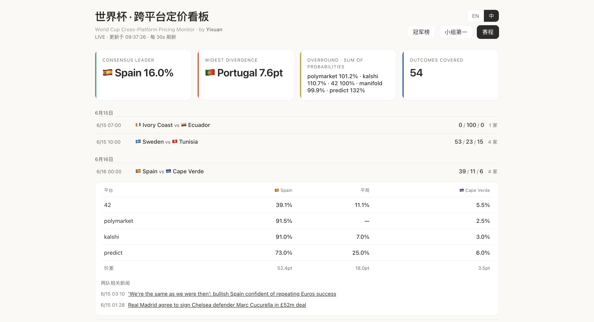

**点一条新闻，查看两队在新闻前后的赔率；⚡ 是看板捕捉到的共识异动：**

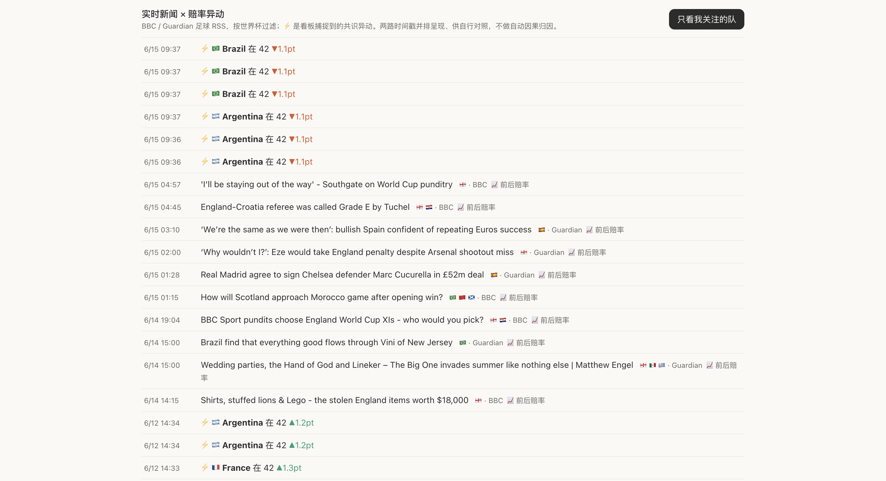

**新闻弹幕——新闻像弹幕一样从顶部飘过；把鼠标移到某条上会暂停，方便阅读或点开，右上角按钮可整体关闭：**

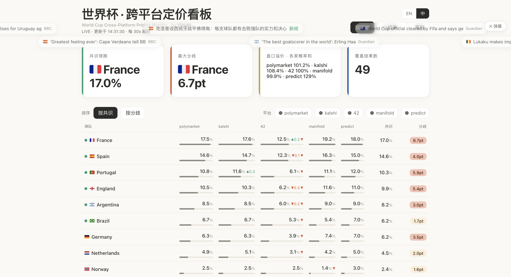

**一张图看懂新闻 × 赔率——把新闻时刻落在每个平台前后数小时的价格线上，新闻与价格变动之间的时间关系一眼可见（呈现的是时间关系，而非因果结论）：**

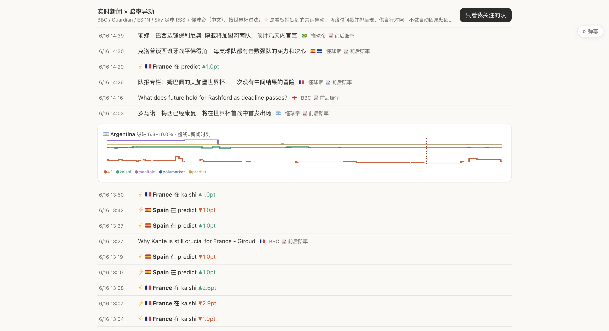

**可自选的关注列表——每张卡片显示逐平台赔率与多平台历史走势线：**

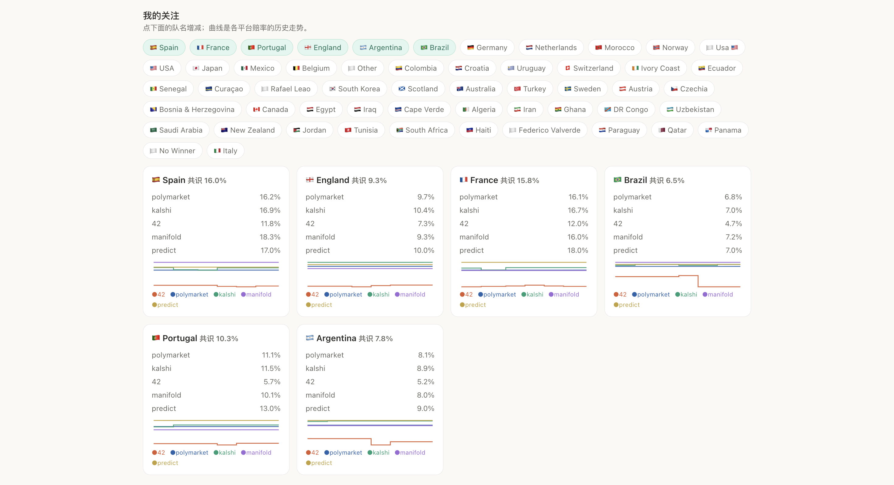

## 🆕 新上线功能 —— 复盘看板 & 球队名片

比赛一旦结束，问题就从“会发生什么”变成了 ***“谁定价定对了——其他平台又错得有多离谱？”*** 本次更新在项目的核心理念 **校准而非预测** 之下，加了一整层复盘能力。

### 复盘看板

- 对每一场已结束的比赛做**「赛前定价 vs 真实结果」复盘**：把赛前五平台共识与真实的 胜/平/负 并排，并给出命中或落空的判定。
- 顶部置顶一块**市场共识战绩**——共识看好的一方究竟兑现了多少次——支持一键按 *兑现 / 落空* 筛选。
- **平台校准**：一张校准曲线图，外加五个平台的 **Brier 准确度排行**。
- 每张卡片一句**可传播的标题**——有差异、不套模板、双语（英文大字标题，中文模式下附中文小字）。
- 横向**日期标签**，点哪天看哪天。
- **一键导出小卡**（1080×1350 PNG），带标题条、五平台表格，以及回到实时看板的**二维码 + 链接**。

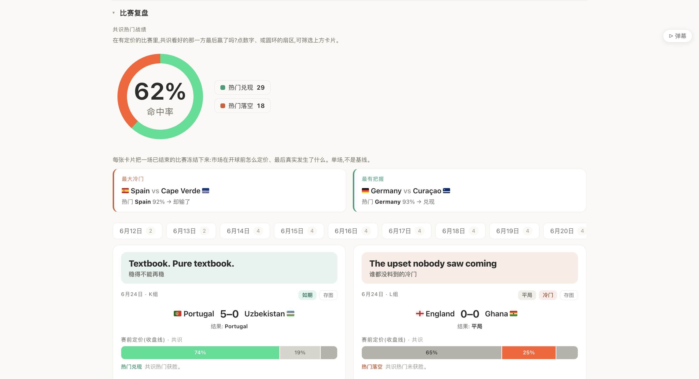

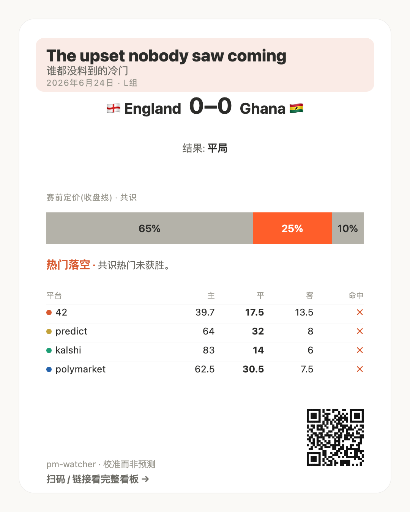

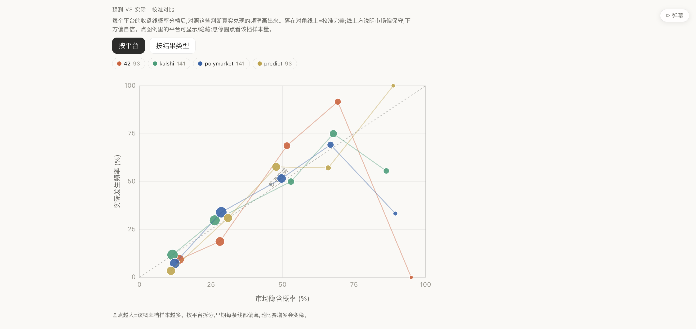

### 球队名片

- 为**全部 48 强**各做一张可收藏的小卡，采用 WC26 官方海报视觉语言——每个国家有**固定的主色 + 纹理**（12 种大块纹理，没有两国雷同），视觉系统锁定、只更新数据。
- 一个 **意外指数**（S / A / B / C，0–100）与一个巨大的 **±% 偏差**数字：市场对这支球队的定价偏离真实结果有多远（衡量的是“市场看走眼的程度”，不是球队实力）。
- 战绩、进/失球、制造的冷门，以及该队最意外的一场。
- **一键导出 PNG**，带二维码深链直达看板上的该队；中英双语；历史冠军镀金星。

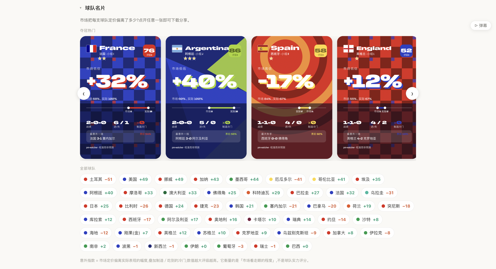

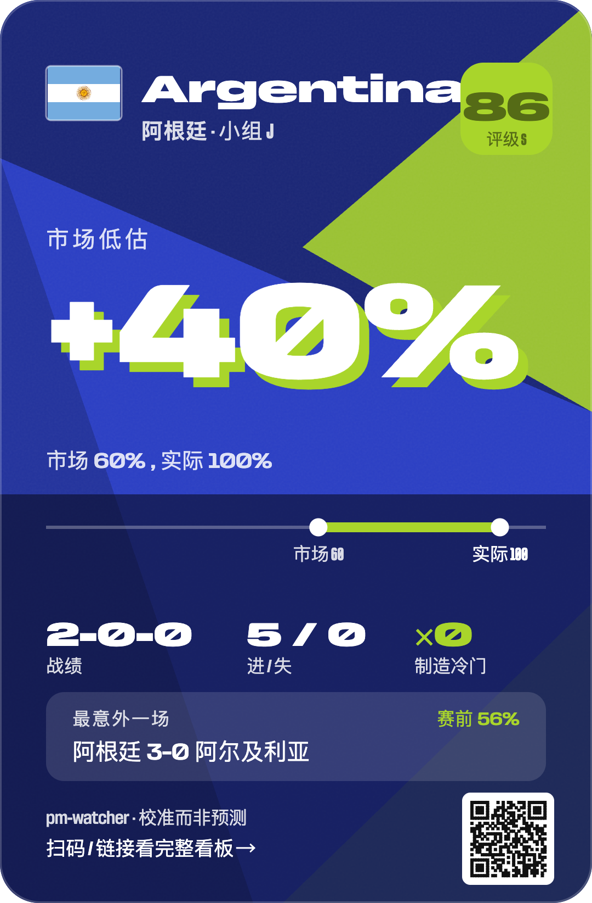

> 这两块看板都是**回顾性的、只读的**——它们描述的是市场为*已经发生*的比赛所做的定价。依然不预测、不下注。

## 快速开始

```bash
pip install -r requirements.txt

# 网页看板（推荐）：
python3 -m pm_watcher.serve --live --interval 30
# 然后浏览器打开 http://127.0.0.1:8765

# 或命令行模式：
python3 -m pm_watcher.watch --query "World Cup" --board --live
```

无需任何 API key。部分数据源在部分网络环境下需要代理（`export HTTPS_PROXY=...`）。

Telegram 推送（可选）：复制 `.env.example` 为 `.env`，填入从 @BotFather 获取的 token 与你的 chat id，命令行模式下加 `--notify`。

## 真正值得一看的部分：过程

跨平台比价听起来不过是"把几个数字并排"。实际做下来，每个平台都设了一道关卡——**这些字段层面的经验，比代码本身更有价值**：

1. **42 的 `price` 字段不是概率。** 它是债券曲线上的代币价（量级约 0.0008），各结果之和远不到 1。真正的隐含概率在 `marketCap` 占比里——每个结果的市值 ÷ 市场总市值，加起来正好 100%。直接用 `price`，整列数据都是错的。
2. **Kalshi 改过价格单位。** 旧字段是美分（需 ÷100），新字段 `last_price_dollars` 已是 0~1。两者同时存在于返回中，取错一个，所有概率相差 100 倍。
3. **42 的接口会拒绝"不像浏览器"的请求。** 同一个 URL，浏览器能打开，裸客户端被拒。补上 `Origin`、`Referer` 和真实 User-Agent 即可。WAF 不会告诉你它想要什么。
4. **Metaculus 的"公开 API"已不再公开。** 文档上看着可用，实际返回是 `only available to authenticated users`。判断一个 API 是否可用，唯一可靠的办法是真的请求一次。
5. **Predict.fun 官方 API 需要 key，但它的网页前端走一条开放的 GraphQL。** Introspection 全开——顺着 schema 摸下去，发现了完整的世界杯赛程接口（80 场比赛、真实开球时间）。最丰富的数据源，在文档之外。
6. **42 的单场是精确比分盘**（如 `NED 0–1 JPN`），不是胜平负盘。本项目把比分概率汇总推导为三向价；无法归类的结果诚实丢弃，因此 42 的三向之和可能略低于 100%，而非强行归一。
7. **同一支球队，在五个平台有五种名字。** Türkiye/Turkey、Korea Republic/South Korea、Cabo Verde/Cape Verde、两种 Bosnia 拼写。不做规范化归一，跨平台对比就会把同一支队当成两支。

## 一些观察（小组赛开打之际）

- 头部定价高度一致：西班牙、法国在 Polymarket 与 Kalshi 之间常年相差约 0.5pt 以内——深度盘口的有效性清晰可见。
- 42 系统性偏低：葡萄牙、德国、阿根廷在 42 上比 Polymarket/Kalshi 低约 3pt——薄流动性，以及把概率质量分流给 N/A 结果的市场结构留下的痕迹。
- play-money（Manifold）与现金盘之间的差距本身就是信号：play-money 预测者给西班牙更高的概率，真金白银更为审慎。

## 架构

```
pm_watcher/
├── model.py        # Market/Outcome 数据模型 + 客户端基类
├── polymarket.py   # Gamma API（公开 REST）
├── kalshi.py       # trade-api v2（公开 REST；KXWCGAME 单场 / KXWCGROUPWIN 小组）
├── fortytwo.py     # rest.ft.42.space（公开 REST；比分盘→三向推导）
├── manifold.py     # 公开 REST（play-money 预测者共识）
├── predict.py      # 前端公开 GraphQL（含 80 场赛程）
├── names.py        # 国名规范化 + 48 强名单
├── aggregator.py   # 跨平台归并（榜单 / 赛程）
├── history.py      # SQLite 变动驱动落盘
├── news.py         # BBC/Guardian/ESPN/Sky RSS + 懂球帝，按世界杯/球队过滤
├── notifier.py     # Telegram 推送
├── serve.py        # 本地看板服务（http://127.0.0.1:8765）
├── dashboard.html  # 单页看板（无前端构建链）
└── watch.py        # 命令行模式
```

依赖只有 `httpx`（与可选的 `python-dotenv`）。看板是一个自包含的 HTML 文件，无前端构建链。

## 数据源

| 平台 | 性质 | 接入方式 | 概率口径 | 注意 |
|---|---|---|---|---|
| Polymarket | 现金盘（Polygon） | 公开 Gamma REST | `outcomePrices`（0~1） | 深度最好 |
| Kalshi | 现金盘（CFTC 持牌） | 公开 trade-api | `last_price_dollars` | 平局记作 "Tie" |
| 42 | 链上盘（Alpha） | 公开 REST | `marketCap` 占比 | 流动性薄；单场为比分盘 |
| Manifold | **play-money** | 公开 REST | `probability` | 预测者共识，非真钱 |
| Predict.fun | 现金盘（BNB） | 前端公开 GraphQL | `chancePercentage` | 整数粒度（0.5pt 以内为噪声） |

## 诚实边界

- **这不是套利工具。** 看板呈现的价差，绝大多数不可执行：手续费、结算口径差异、资金锁定、薄盘的不可成交性，以及平台与合约风险，都会吃掉名义价差。它的价值在于**理解市场如何为一个事件定价**，而非从中提取利润。
- 各平台对不同司法辖区的可用性差异很大。请自行核实你所在地的法律与各平台条款。本项目仅读取公开行情，不涉及注册、交易或资金。
- 新闻 × 赔率图呈现的是**时间关系，而非因果结论**。
- 本项目不构成任何投资建议。

## License

MIT © Yixuan

*Built in collaboration with Claude (Anthropic).*
